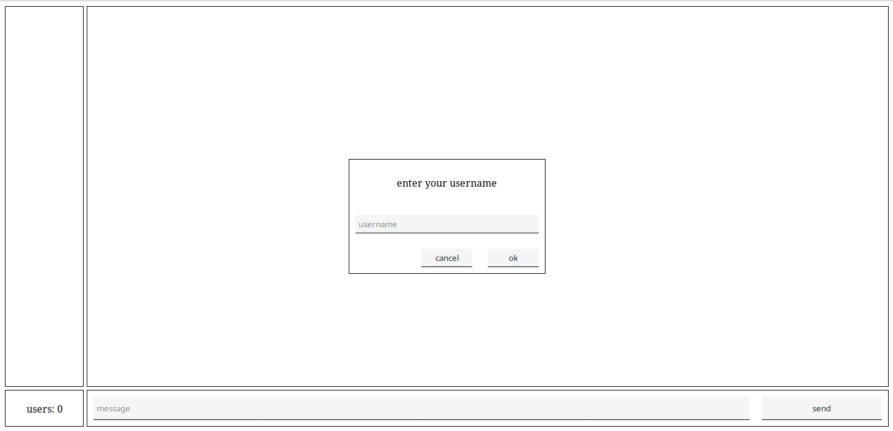
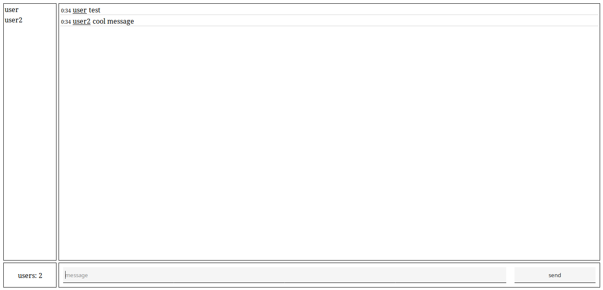

# goshoutbox

Simple websocket shoutbox written in go and pure javascript

## Setup

* Install go https://golang.org/doc/install
* Copy the `example-config.json` to your current directory, rename it to `config.json`, modify it (for example, delete the tls section, otherwise the server won't start until you provide the ssl certificates - of course it's not a good idea in practice, but it's ok just for testing the server out)
* Run `go run github.com/plaets/goshoutbox/cmd/goshoutbox/` or `go build github.com/plaets/goshoutbox/cmd/goshoutbox/` and copy the executable from `$GOPATH/src/github.com/plaets/goshoutbox/cmd/goshoutbox/goshoutbox`

## Todo

* Configuration
* Custom emoticons
* Basic markdown
* Private messages 
* Basic administration
* Flooding prevention

### Future

* Authentication plugins / reserving nicknames
* Channels
* More sophisticated logging/history
* Stats
* Filters (word, links, etc)
* Admin notifications

## Configuration 

Configuration is stored in the `config.json` file. Example configuration can be seen in `example-config.json`.

```
{
    "server": { 
        "addr": ":9000", //address that the http server should listen on
        "tls": { //(optional) ssl config
            "addr": ":9001", //address that the https server should listen on
            "key": "server.key", //path to the ssl key 
            "cert": "server.crt" //path to the ssl certificate
        }
    }
}
```

## Screenshots



